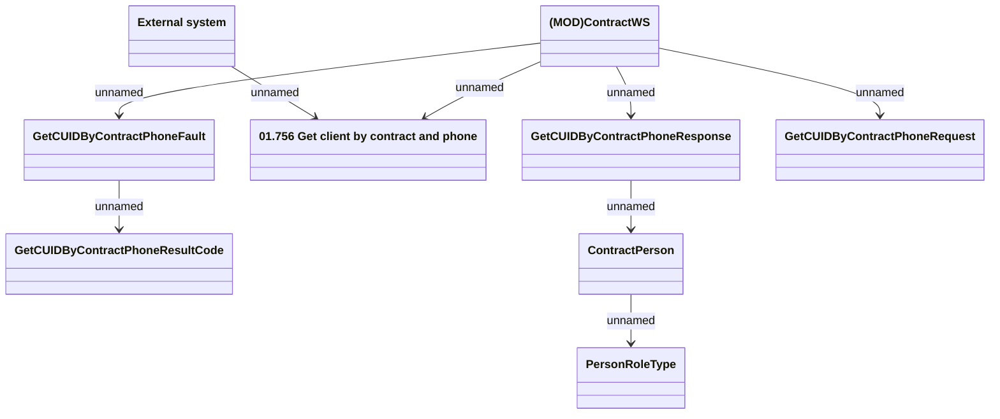

# ContractWS - GetCUIDByContractPhone

```mermaid
classDiagram
    class GetCUIDByContractPhoneResultCode["GetCUIDByContractPhoneResultCode"]
    class GetCUIDByContractPhoneFault["GetCUIDByContractPhoneFault"]
    class External_system["External system"]
    class n_01_756_Get_client_by_contract_and_phone["01.756 Get client by contract and phone"]
    class PersonRoleType["PersonRoleType"]
    class ContractPerson["ContractPerson"]
    class GetCUIDByContractPhoneResponse["GetCUIDByContractPhoneResponse"]
    class GetCUIDByContractPhoneRequest["GetCUIDByContractPhoneRequest"]
    class MOD_ContractWS["(MOD)ContractWS"]
    MOD_ContractWS --> GetCUIDByContractPhoneRequest : unnamed
    MOD_ContractWS --> GetCUIDByContractPhoneResponse : unnamed
    GetCUIDByContractPhoneResponse --> ContractPerson : unnamed
    MOD_ContractWS --> n_01_756_Get_client_by_contract_and_phone : unnamed
    MOD_ContractWS --> GetCUIDByContractPhoneFault : unnamed
    GetCUIDByContractPhoneFault --> GetCUIDByContractPhoneResultCode : unnamed
    ContractPerson --> PersonRoleType : unnamed
    External_system --> n_01_756_Get_client_by_contract_and_phone : unnamed
```
