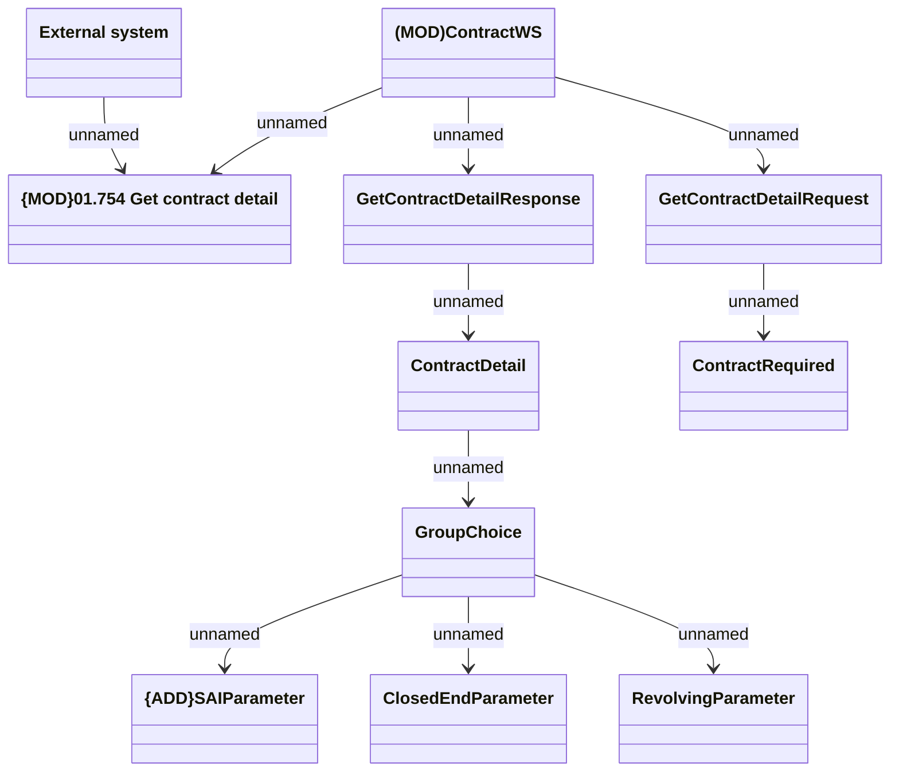

# ContractWS - GetContractDetail method

```mermaid
classDiagram
    class ADD_SAIParameter["{ADD}SAIParameter"]
    class External_system["External system"]
    class MOD_01_754_Get_contract_detail["{MOD}01.754 Get contract detail"]
    class ContractDetail["ContractDetail"]
    class GroupChoice["GroupChoice"]
    class RevolvingParameter["RevolvingParameter"]
    class ClosedEndParameter["ClosedEndParameter"]
    class GetContractDetailResponse["GetContractDetailResponse"]
    class ContractRequired["ContractRequired"]
    class GetContractDetailRequest["GetContractDetailRequest"]
    class MOD_ContractWS["(MOD)ContractWS"]
    MOD_ContractWS --> GetContractDetailRequest : unnamed
    GetContractDetailRequest --> ContractRequired : unnamed
    MOD_ContractWS --> GetContractDetailResponse : unnamed
    GetContractDetailResponse --> ContractDetail : unnamed
    MOD_ContractWS --> MOD_01_754_Get_contract_detail : unnamed
    GroupChoice --> ADD_SAIParameter : unnamed
    GroupChoice --> ClosedEndParameter : unnamed
    ContractDetail --> GroupChoice : unnamed
    GroupChoice --> RevolvingParameter : unnamed
    External_system --> MOD_01_754_Get_contract_detail : unnamed
```
