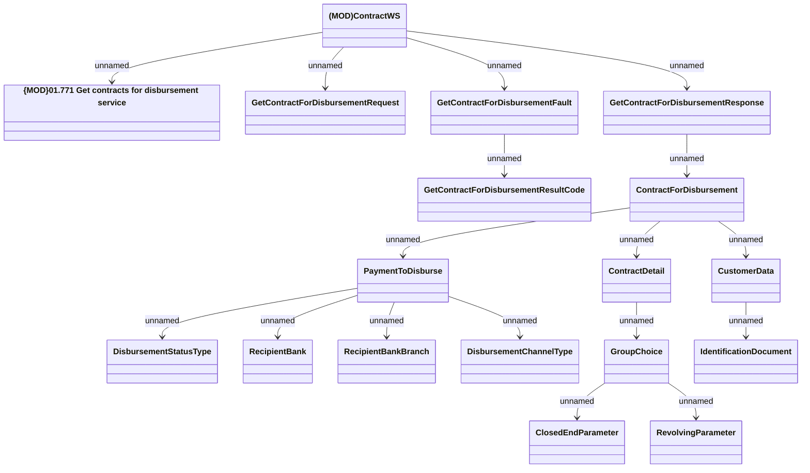

# ContractWS - GetContractForDisbursement

```mermaid
classDiagram
    class DisbursementStatusType["DisbursementStatusType"]
    class MOD_01_771_Get_contracts_for_disbursement_service["{MOD}01.771 Get contracts for disbursement service"]
    class IdentificationDocument["IdentificationDocument"]
    class CustomerData["CustomerData"]
    class RecipientBankBranch["RecipientBankBranch"]
    class RecipientBank["RecipientBank"]
    class DisbursementChannelType["DisbursementChannelType"]
    class GetContractForDisbursementResultCode["GetContractForDisbursementResultCode"]
    class PaymentToDisburse["PaymentToDisburse"]
    class ContractDetail["ContractDetail"]
    class GroupChoice["GroupChoice"]
    class RevolvingParameter["RevolvingParameter"]
    class ClosedEndParameter["ClosedEndParameter"]
    class ContractForDisbursement["ContractForDisbursement"]
    class GetContractForDisbursementFault["GetContractForDisbursementFault"]
    class GetContractForDisbursementResponse["GetContractForDisbursementResponse"]
    class MOD_ContractWS["(MOD)ContractWS"]
    class GetContractForDisbursementRequest["GetContractForDisbursementRequest"]
    MOD_ContractWS --> MOD_01_771_Get_contracts_for_disbursement_service : unnamed
    MOD_ContractWS --> GetContractForDisbursementRequest : unnamed
    GetContractForDisbursementResponse --> ContractForDisbursement : unnamed
    MOD_ContractWS --> GetContractForDisbursementFault : unnamed
    MOD_ContractWS --> GetContractForDisbursementResponse : unnamed
    GetContractForDisbursementFault --> GetContractForDisbursementResultCode : unnamed
    PaymentToDisburse --> DisbursementStatusType : unnamed
    GroupChoice --> ClosedEndParameter : unnamed
    CustomerData --> IdentificationDocument : unnamed
    PaymentToDisburse --> RecipientBank : unnamed
    PaymentToDisburse --> RecipientBankBranch : unnamed
    ContractForDisbursement --> PaymentToDisburse : unnamed
    PaymentToDisburse --> DisbursementChannelType : unnamed
    ContractDetail --> GroupChoice : unnamed
    ContractForDisbursement --> ContractDetail : unnamed
    ContractForDisbursement --> CustomerData : unnamed
    GroupChoice --> RevolvingParameter : unnamed
```
