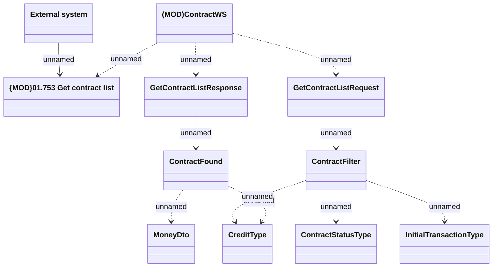

# ContractWS - GetContractList method

- **Diagram Type**: Logical
- **Package**: HomerSelect/BSL/Analysis Model/_Interface/Provided Web Services/Contract/ContractWS
- **Diagram ID**: 159588
- **Elements**: 11
- **Connectors**: 11

