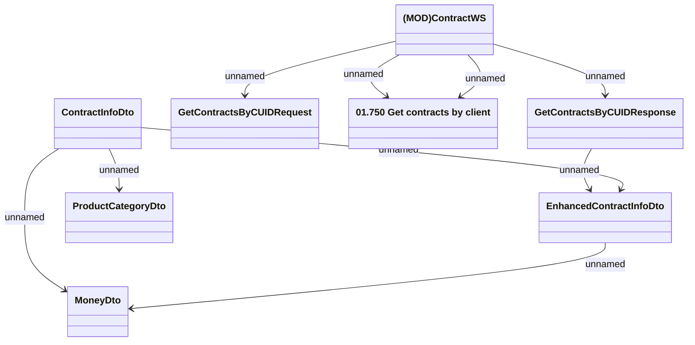

# ContractWS - GetContracts by CUID 2

```mermaid
classDiagram
    class EnhancedContractInfoDto["EnhancedContractInfoDto"]
    class GetContractsByCUIDResponse["GetContractsByCUIDResponse"]
    class GetContractsByCUIDRequest["GetContractsByCUIDRequest"]
    class n_01_750_Get_contracts_by_client["01.750 Get contracts by client"]
    class ProductCategoryDto["ProductCategoryDto"]
    class MoneyDto["MoneyDto"]
    class ContractInfoDto["ContractInfoDto"]
    class MOD_ContractWS["(MOD)ContractWS"]
    MOD_ContractWS --> n_01_750_Get_contracts_by_client : unnamed
    MOD_ContractWS --> n_01_750_Get_contracts_by_client : unnamed
    MOD_ContractWS --> GetContractsByCUIDRequest : unnamed
    MOD_ContractWS --> GetContractsByCUIDResponse : unnamed
    GetContractsByCUIDResponse --> EnhancedContractInfoDto : unnamed
    ContractInfoDto --> ProductCategoryDto : unnamed
    ContractInfoDto --> EnhancedContractInfoDto : unnamed
    ContractInfoDto --> MoneyDto : unnamed
    EnhancedContractInfoDto --> MoneyDto : unnamed
```
