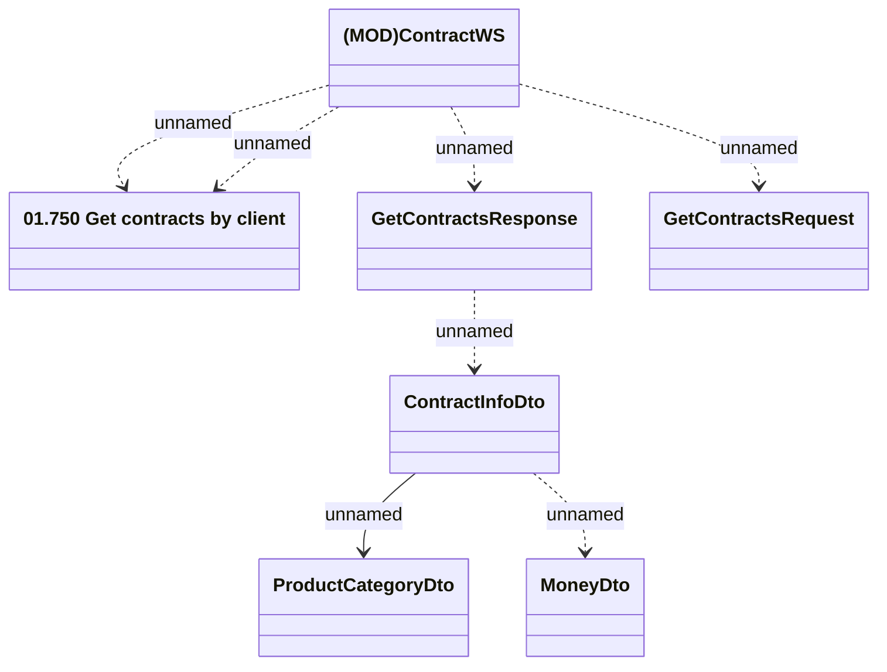

# ContractWS - GetContracts by CUID

- **Diagram Type**: Logical
- **Package**: HomerSelect/BSL/Analysis Model/_Interface/Provided Web Services/Contract/ContractWS
- **Diagram ID**: 159593
- **Elements**: 7
- **Connectors**: 7

