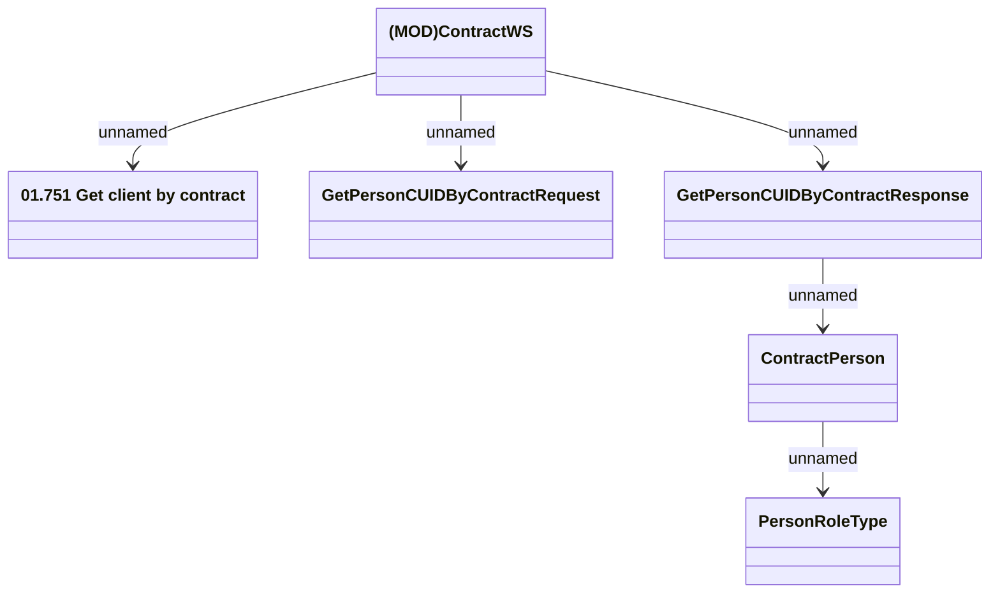

# ContractWS - GetPersonCUIDByContract method

```mermaid
classDiagram
    class n_01_751_Get_client_by_contract["01.751 Get client by contract"]
    class PersonRoleType["PersonRoleType"]
    class GetPersonCUIDByContractRequest["GetPersonCUIDByContractRequest"]
    class MOD_ContractWS["(MOD)ContractWS"]
    class ContractPerson["ContractPerson"]
    class GetPersonCUIDByContractResponse["GetPersonCUIDByContractResponse"]
    MOD_ContractWS --> GetPersonCUIDByContractResponse : unnamed
    GetPersonCUIDByContractResponse --> ContractPerson : unnamed
    MOD_ContractWS --> GetPersonCUIDByContractRequest : unnamed
    MOD_ContractWS --> n_01_751_Get_client_by_contract : unnamed
    ContractPerson --> PersonRoleType : unnamed
```
