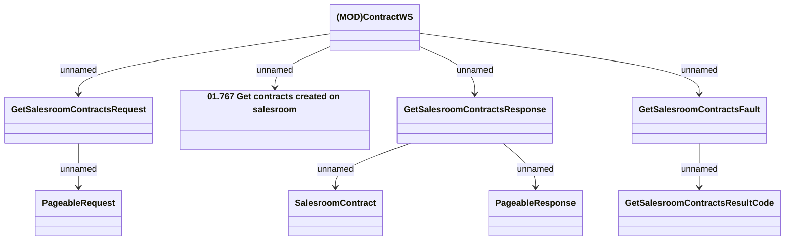

# ContractWS - GetSalesroomContracts

```mermaid
classDiagram
    class PageableResponse["PageableResponse"]
    class PageableRequest["PageableRequest"]
    class GetSalesroomContractsResultCode["GetSalesroomContractsResultCode"]
    class GetSalesroomContractsFault["GetSalesroomContractsFault"]
    class SalesroomContract["SalesroomContract"]
    class n_01_767_Get_contracts_created_on_salesroom["01.767 Get contracts created on salesroom"]
    class GetSalesroomContractsResponse["GetSalesroomContractsResponse"]
    class GetSalesroomContractsRequest["GetSalesroomContractsRequest"]
    class MOD_ContractWS["(MOD)ContractWS"]
    MOD_ContractWS --> GetSalesroomContractsRequest : unnamed
    MOD_ContractWS --> GetSalesroomContractsResponse : unnamed
    MOD_ContractWS --> n_01_767_Get_contracts_created_on_salesroom : unnamed
    GetSalesroomContractsResponse --> SalesroomContract : unnamed
    MOD_ContractWS --> GetSalesroomContractsFault : unnamed
    GetSalesroomContractsFault --> GetSalesroomContractsResultCode : unnamed
    GetSalesroomContractsRequest --> PageableRequest : unnamed
    GetSalesroomContractsResponse --> PageableResponse : unnamed
```
