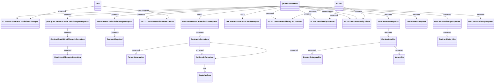

# ContractWS - methods for internal usage

```mermaid
classDiagram
    class n_01_175_Get_contracts_credit_limit_changes["01.175 Get contracts credit limit changes"]
    class ContractCreditLimitChangeInformation["ContractCreditLimitChangeInformation"]
    class CreditLimitChangeInformation["CreditLimitChangeInformation"]
    class ContractRequired["ContractRequired"]
    class ADD_GetContractCreditLimitChangesResponse["{ADD}GetContractCreditLimitChangesResponse"]
    class GetContractCreditLimitChangesRequest["GetContractCreditLimitChangesRequest"]
    class KeyValueType["KeyValueType"]
    class n_01_173_Get_contracts_for_cross_checks["01.173 Get contracts for cross checks"]
    class LAP["LAP"]
    class PersonInformation["PersonInformation"]
    class AddressInformation["AddressInformation"]
    class ContractInformation["ContractInformation"]
    class GetContractsForCrossChecksResponse["GetContractsForCrossChecksResponse"]
    class GetContractsForCrossChecksRequest["GetContractsForCrossChecksRequest"]
    class BOOK["BOOK"]
    class n_01_752_Get_contract_history_for_contract["01.752 Get contract history for contract"]
    class n_01_751_Get_client_by_contract["01.751 Get client by contract"]
    class n_01_750_Get_contracts_by_client["01.750 Get contracts by client"]
    class ProductCategoryDto["ProductCategoryDto"]
    class MoneyDto["MoneyDto"]
    class GetContractsResponse["GetContractsResponse"]
    class GetContractsRequest["GetContractsRequest"]
    class ContractInfoDto["ContractInfoDto"]
    class GetContractHistoryResponse["GetContractHistoryResponse"]
    class GetContractHistoryRequest["GetContractHistoryRequest"]
    class ContractHistoryDto["ContractHistoryDto"]
    class MOD_ContractWS["(MOD)ContractWS"]
    MOD_ContractWS --> n_01_752_Get_contract_history_for_contract : unnamed
    ADD_GetContractCreditLimitChangesResponse --> ContractCreditLimitChangeInformation : unnamed
    GetContractCreditLimitChangesRequest --> ContractRequired : unnamed
    MOD_ContractWS --> ADD_GetContractCreditLimitChangesResponse : unnamed
    MOD_ContractWS --> GetContractCreditLimitChangesRequest : unnamed
    MOD_ContractWS --> n_01_173_Get_contracts_for_cross_checks : unnamed
    GetContractsForCrossChecksResponse --> ContractInformation : unnamed
    MOD_ContractWS --> n_01_175_Get_contracts_credit_limit_changes : unnamed
    MOD_ContractWS --> n_01_750_Get_contracts_by_client : unnamed
    MOD_ContractWS --> GetContractHistoryRequest : unnamed
    MOD_ContractWS --> GetContractHistoryResponse : unnamed
    GetContractsResponse --> ContractInfoDto : unnamed
    MOD_ContractWS --> GetContractsRequest : unnamed
    MOD_ContractWS --> GetContractsResponse : unnamed
    MOD_ContractWS --> GetContractsForCrossChecksResponse : output
    MOD_ContractWS --> GetContractsForCrossChecksRequest : input
    MOD_ContractWS --> n_01_750_Get_contracts_by_client : unnamed
    MOD_ContractWS --> n_01_751_Get_client_by_contract : unnamed
    GetContractHistoryResponse --> ContractHistoryDto : unnamed
    ContractInformation --> AddressInformation : unnamed
    ContractInformation --> AddressInformation : unnamed
    AddressInformation --> KeyValueType : use
    ContractInfoDto --> ProductCategoryDto : unnamed
    ContractInfoDto --> MoneyDto : unnamed
    ContractCreditLimitChangeInformation --> CreditLimitChangeInformation : unnamed
    ContractInformation --> PersonInformation : unnamed
    LAP --> n_01_175_Get_contracts_credit_limit_changes : unnamed
    LAP --> n_01_173_Get_contracts_for_cross_checks : unnamed
    BOOK --> n_01_752_Get_contract_history_for_contract : unnamed
    BOOK --> n_01_751_Get_client_by_contract : unnamed
    BOOK --> n_01_750_Get_contracts_by_client : unnamed
```
