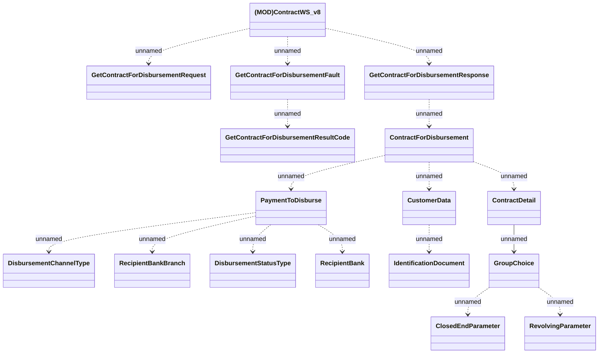

# ContractWS_v8

- **Diagram Type**: Logical
- **Package**: HomerSelect/BSL/Analysis Model/_Interface/Provided Web Services/Contract/ContractWS/ContractWS_v8
- **Diagram ID**: 159596
- **Elements**: 17
- **Connectors**: 16

