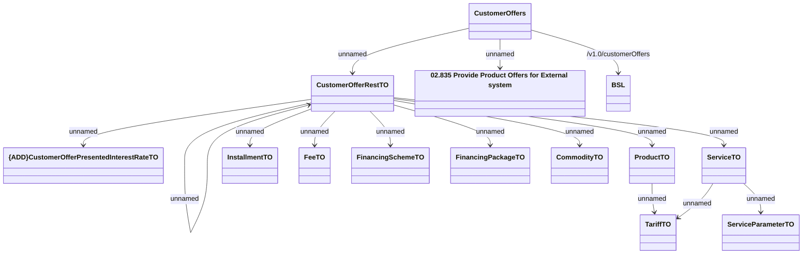

# CustomerOfferRestV1 - GetCustomerOffer

```mermaid
classDiagram
    class ADD_CustomerOfferPresentedInterestRateTO["{ADD}CustomerOfferPresentedInterestRateTO"]
    class ServiceParameterTO["ServiceParameterTO"]
    class TariffTO["TariffTO"]
    class ServiceTO["ServiceTO"]
    class ProductTO["ProductTO"]
    class InstallmentTO["InstallmentTO"]
    class FeeTO["FeeTO"]
    class FinancingSchemeTO["FinancingSchemeTO"]
    class FinancingPackageTO["FinancingPackageTO"]
    class CommodityTO["CommodityTO"]
    class CustomerOfferRestTO["CustomerOfferRestTO"]
    class CustomerOfferRestTO["CustomerOfferRestTO"]
    class n_02_835_Provide_Product_Offers_for_External_system["02.835 Provide Product Offers for External system"]
    class CustomerOffers["CustomerOffers"]
    class BSL["BSL"]
    CustomerOffers --> n_02_835_Provide_Product_Offers_for_External_system : unnamed
    CustomerOffers --> CustomerOfferRestTO : unnamed
    CustomerOffers --> BSL : /v1.0/customerOffers
    CustomerOfferRestTO --> CustomerOfferRestTO : unnamed
    CustomerOfferRestTO --> CommodityTO : unnamed
    CustomerOfferRestTO --> FinancingSchemeTO : unnamed
    CustomerOfferRestTO --> InstallmentTO : unnamed
    CustomerOfferRestTO --> ADD_CustomerOfferPresentedInterestRateTO : unnamed
    CustomerOfferRestTO --> FinancingPackageTO : unnamed
    CustomerOfferRestTO --> ProductTO : unnamed
    CustomerOfferRestTO --> ServiceTO : unnamed
    CustomerOfferRestTO --> FeeTO : unnamed
    ProductTO --> TariffTO : unnamed
    ServiceTO --> ServiceParameterTO : unnamed
    ServiceTO --> TariffTO : unnamed
```
