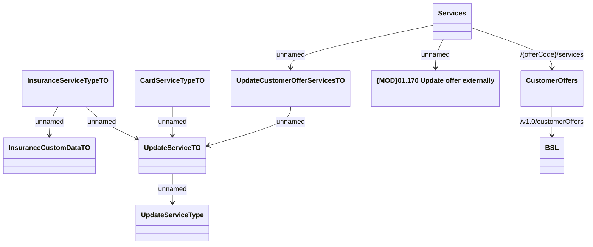

# CustomerOfferRestV1 - UpdateOffer

```mermaid
classDiagram
    class UpdateServiceType["UpdateServiceType"]
    class InsuranceServiceTypeTO["InsuranceServiceTypeTO"]
    class InsuranceCustomDataTO["InsuranceCustomDataTO"]
    class CardServiceTypeTO["CardServiceTypeTO"]
    class UpdateServiceTO["UpdateServiceTO"]
    class UpdateCustomerOfferServicesTO["UpdateCustomerOfferServicesTO"]
    class MOD_01_170_Update_offer_externally["{MOD}01.170 Update offer externally"]
    class Services["Services"]
    class CustomerOffers["CustomerOffers"]
    class BSL["BSL"]
    CustomerOffers --> BSL : /v1.0/customerOffers
    Services --> CustomerOffers : /{offerCode}/services
    Services --> UpdateCustomerOfferServicesTO : unnamed
    Services --> MOD_01_170_Update_offer_externally : unnamed
    UpdateCustomerOfferServicesTO --> UpdateServiceTO : unnamed
    UpdateServiceTO --> UpdateServiceType : unnamed
    CardServiceTypeTO --> UpdateServiceTO : unnamed
    InsuranceServiceTypeTO --> UpdateServiceTO : unnamed
    InsuranceServiceTypeTO --> InsuranceCustomDataTO : unnamed
```
