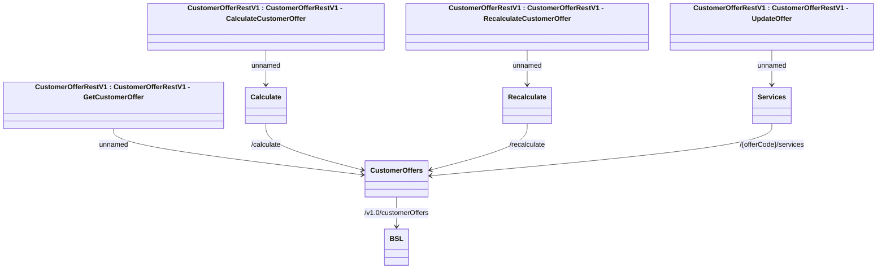

# CustomerOfferRestV1

```mermaid
classDiagram
    class CustomerOfferRestV1_CustomerOfferRestV1_UpdateOffer["CustomerOfferRestV1 : CustomerOfferRestV1 - UpdateOffer"]
    class Services["Services"]
    class CustomerOfferRestV1_CustomerOfferRestV1_RecalculateCustomerO["CustomerOfferRestV1 : CustomerOfferRestV1 - RecalculateCustomerOffer"]
    class Recalculate["Recalculate"]
    class CustomerOfferRestV1_CustomerOfferRestV1_CalculateCustomerOff["CustomerOfferRestV1 : CustomerOfferRestV1 - CalculateCustomerOffer"]
    class Calculate["Calculate"]
    class CustomerOfferRestV1_CustomerOfferRestV1_GetCustomerOffer["CustomerOfferRestV1 : CustomerOfferRestV1 - GetCustomerOffer"]
    class CustomerOffers["CustomerOffers"]
    class BSL["BSL"]
    CustomerOffers --> BSL : /v1.0/customerOffers
    CustomerOfferRestV1_CustomerOfferRestV1_GetCustomerOffer --> CustomerOffers : unnamed
    Calculate --> CustomerOffers : /calculate
    CustomerOfferRestV1_CustomerOfferRestV1_CalculateCustomerOff --> Calculate : unnamed
    Recalculate --> CustomerOffers : /recalculate
    CustomerOfferRestV1_CustomerOfferRestV1_RecalculateCustomerO --> Recalculate : unnamed
    Services --> CustomerOffers : /{offerCode}/services
    CustomerOfferRestV1_CustomerOfferRestV1_UpdateOffer --> Services : unnamed
```
