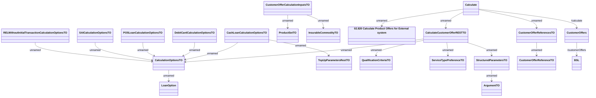

# CustomerOfferRestV2 - CalculateCustomerOffer

```mermaid
classDiagram
    class ArgumentTO["ArgumentTO"]
    class TopUpParametersRestTO["TopUpParametersRestTO"]
    class BSL["BSL"]
    class RELWithoutInitialTransactionCalculationOptionsTO["RELWithoutInitialTransactionCalculationOptionsTO"]
    class SAICalculationOptionsTO["SAICalculationOptionsTO"]
    class POSLoanCalculationOptionsTO["POSLoanCalculationOptionsTO"]
    class DebitCardCalculationOptionsTO["DebitCardCalculationOptionsTO"]
    class CashLoanCalculationOptionsTO["CashLoanCalculationOptionsTO"]
    class LoanOption["LoanOption"]
    class CalculationOptionsTO["CalculationOptionsTO"]
    class CalculateCustomerOfferRESTTO["CalculateCustomerOfferRESTTO"]
    class ProductSetTO["ProductSetTO"]
    class QualificationCriteriaTO["QualificationCriteriaTO"]
    class ServiceTypePreferenceTO["ServiceTypePreferenceTO"]
    class InsurableCommodityTO["InsurableCommodityTO"]
    class CustomerOfferCalculationInputsTO["CustomerOfferCalculationInputsTO"]
    class CustomerOfferReferenceTO["CustomerOfferReferenceTO"]
    class CustomerOfferReferencesTO["CustomerOfferReferencesTO"]
    class n_02_820_Calculate_Product_Offers_for_External_system["02.820 Calculate Product Offers for External system"]
    class Calculate["Calculate"]
    class CustomerOffers["CustomerOffers"]
    class StructuredParametersTO["StructuredParametersTO "]
    SAICalculationOptionsTO --> CalculationOptionsTO : unnamed
    POSLoanCalculationOptionsTO --> CalculationOptionsTO : unnamed
    DebitCardCalculationOptionsTO --> CalculationOptionsTO : unnamed
    CashLoanCalculationOptionsTO --> CalculationOptionsTO : unnamed
    CashLoanCalculationOptionsTO --> TopUpParametersRestTO : unnamed
    CalculationOptionsTO --> LoanOption : unnamed
    CalculateCustomerOfferRESTTO --> CalculationOptionsTO : unnamed
    CalculateCustomerOfferRESTTO --> QualificationCriteriaTO : unnamed
    RELWithoutInitialTransactionCalculationOptionsTO --> CalculationOptionsTO : unnamed
    CalculateCustomerOfferRESTTO --> ServiceTypePreferenceTO : unnamed
    StructuredParametersTO --> ArgumentTO : unnamed
    CustomerOfferCalculationInputsTO --> ProductSetTO : unnamed
    CustomerOfferCalculationInputsTO --> InsurableCommodityTO : unnamed
    CustomerOfferReferencesTO --> CustomerOfferReferenceTO : unnamed
    Calculate --> n_02_820_Calculate_Product_Offers_for_External_system : unnamed
    Calculate --> CalculateCustomerOfferRESTTO : unnamed
    Calculate --> CustomerOfferReferencesTO : unnamed
    Calculate --> CustomerOffers : /calculate
    CustomerOffers --> BSL : /customerOffers
    CalculateCustomerOfferRESTTO --> StructuredParametersTO : unnamed
```
