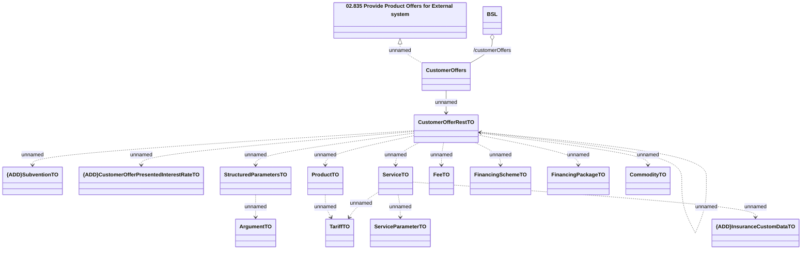

# CustomerOfferRestV2 - GetCustomerOffer

- **Diagram Type**: Logical
- **Package**: HomerSelect/BSL/Analysis Model/_Interface/Provided Web Services/Customer Offer/Customer Offer REST Endpoint/CustomerOfferRestV2
- **Diagram ID**: 164365
- **Elements**: 18
- **Connectors**: 18

