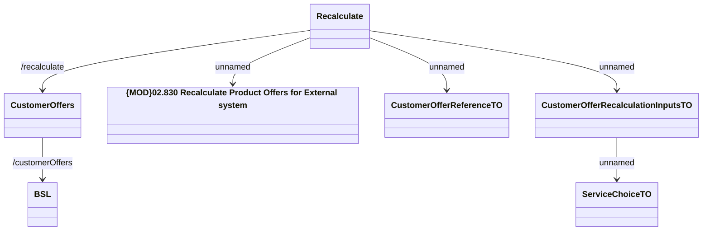

# CustomerOfferRestV2 - RecalculateCustomerOffer

```mermaid
classDiagram
    class BSL["BSL"]
    class ServiceChoiceTO["ServiceChoiceTO"]
    class CustomerOfferRecalculationInputsTO["CustomerOfferRecalculationInputsTO"]
    class Recalculate["Recalculate"]
    class MOD_02_830_Recalculate_Product_Offers_for_External_system["{MOD}02.830 Recalculate Product Offers for External system"]
    class CustomerOfferReferenceTO["CustomerOfferReferenceTO"]
    class CustomerOffers["CustomerOffers"]
    CustomerOffers --> BSL : /customerOffers
    Recalculate --> CustomerOffers : /recalculate
    Recalculate --> MOD_02_830_Recalculate_Product_Offers_for_External_system : unnamed
    Recalculate --> CustomerOfferRecalculationInputsTO : unnamed
    Recalculate --> CustomerOfferReferenceTO : unnamed
    CustomerOfferRecalculationInputsTO --> ServiceChoiceTO : unnamed
```
