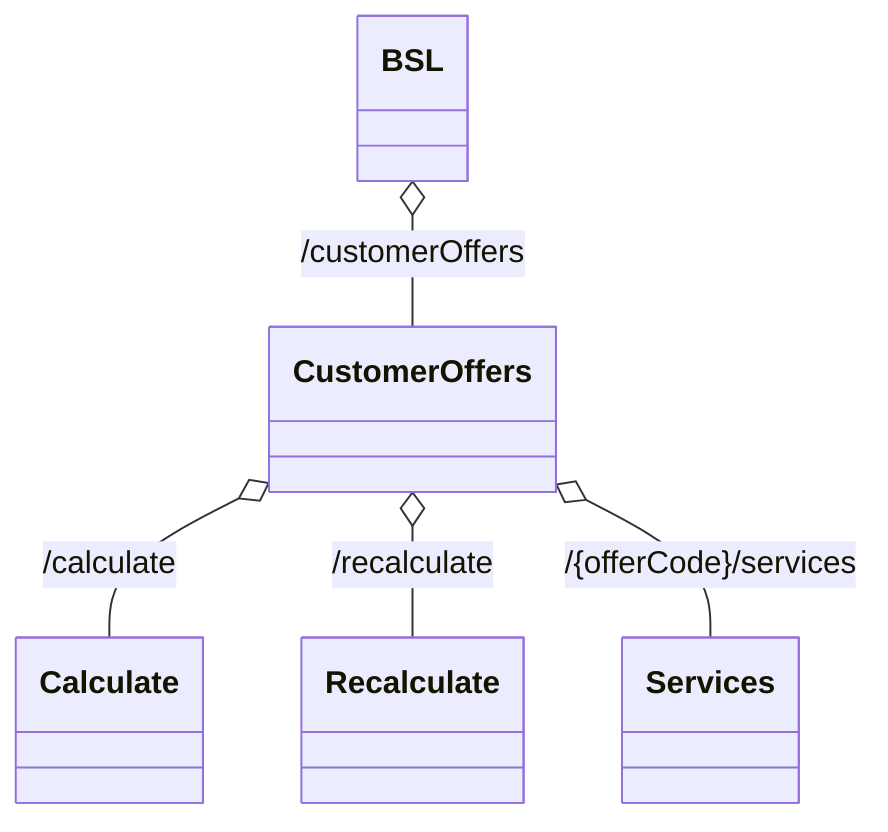

# CustomerOfferRestV2

- **Diagram Type**: Logical
- **Package**: HomerSelect/BSL/Analysis Model/_Interface/Provided Web Services/Customer Offer/Customer Offer REST Endpoint/CustomerOfferRestV2
- **Diagram ID**: 164366
- **Elements**: 5
- **Connectors**: 4

