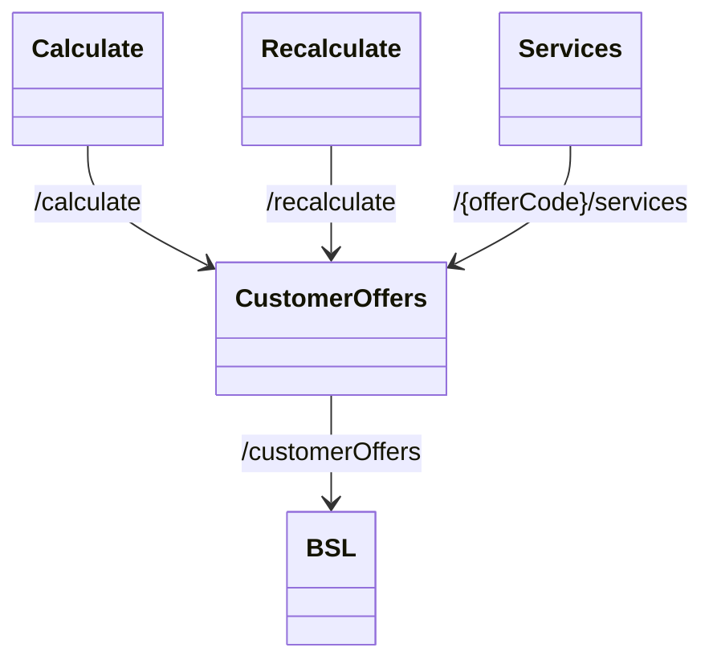

# CustomerOfferRestV2

```mermaid
classDiagram
    class BSL["BSL"]
    class Services["Services"]
    class Recalculate["Recalculate"]
    class Calculate["Calculate"]
    class CustomerOffers["CustomerOffers"]
    CustomerOffers --> BSL : /customerOffers
    Calculate --> CustomerOffers : /calculate
    Recalculate --> CustomerOffers : /recalculate
    Services --> CustomerOffers : /{offerCode}/services
```
