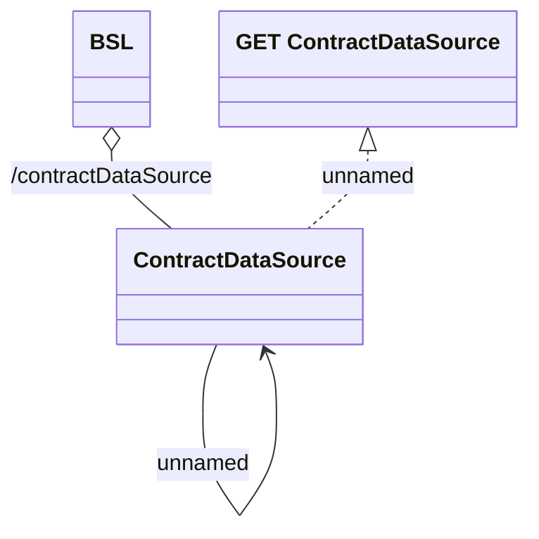

# ContractDataSource (REST)

- **Diagram Type**: Logical
- **Package**: HomerSelect/BSL/Analysis Model/_Interface/Provided Web Services/Data Source Management/ContractDataSource (REST)
- **Diagram ID**: 138358
- **Elements**: 4
- **Connectors**: 3

