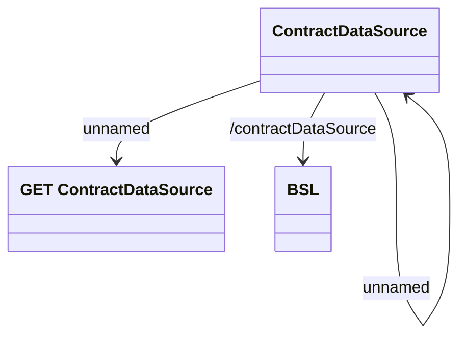

# ContractDataSource (REST)

```mermaid
classDiagram
    class GET_ContractDataSource["GET ContractDataSource"]
    class ContractDataSource["ContractDataSource"]
    class ContractDataSource["ContractDataSource"]
    class BSL["BSL"]
    ContractDataSource --> BSL : /contractDataSource
    ContractDataSource --> ContractDataSource : unnamed
    ContractDataSource --> GET_ContractDataSource : unnamed
```
