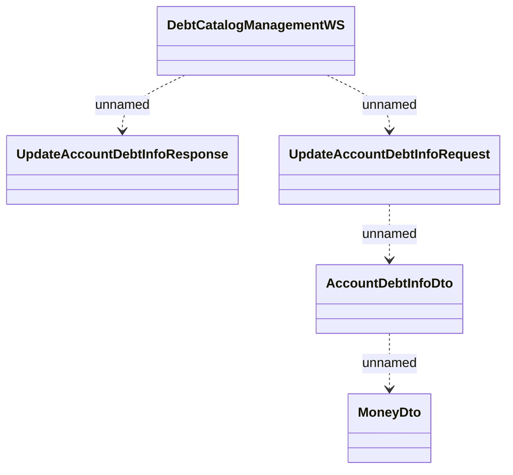

# DebtCatalogManagementWS

- **Diagram Type**: Logical
- **Package**: HomerSelect/BSL/Analysis Model/_Interface/Provided Web Services/Debt Catalog Management
- **Diagram ID**: 45906
- **Elements**: 5
- **Connectors**: 4

