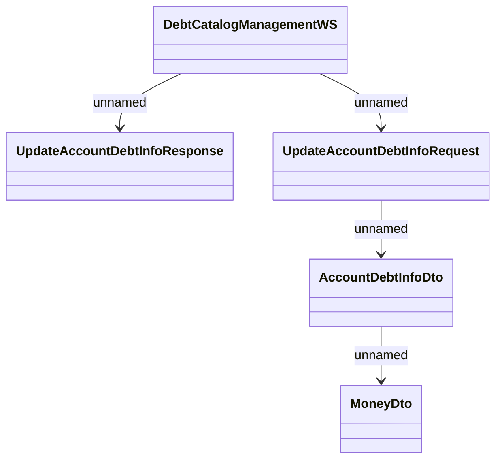

# DebtCatalogManagementWS

```mermaid
classDiagram
    class MoneyDto["MoneyDto"]
    class AccountDebtInfoDto["AccountDebtInfoDto"]
    class UpdateAccountDebtInfoResponse["UpdateAccountDebtInfoResponse"]
    class UpdateAccountDebtInfoRequest["UpdateAccountDebtInfoRequest"]
    class DebtCatalogManagementWS["DebtCatalogManagementWS"]
    DebtCatalogManagementWS --> UpdateAccountDebtInfoRequest : unnamed
    DebtCatalogManagementWS --> UpdateAccountDebtInfoResponse : unnamed
    UpdateAccountDebtInfoRequest --> AccountDebtInfoDto : unnamed
    AccountDebtInfoDto --> MoneyDto : unnamed
```
