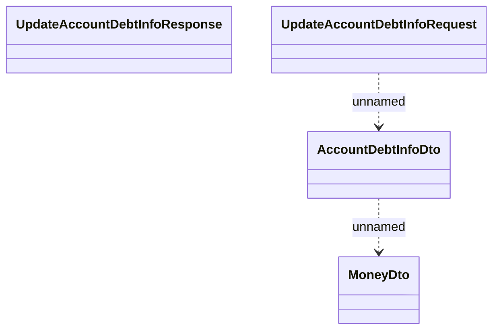

# Debt Catalog Types

- **Diagram Type**: Logical
- **Package**: HomerSelect/BSL/Analysis Model/_Interface/Provided Web Services/Debt Catalog Management/Types
- **Diagram ID**: 111507
- **Elements**: 4
- **Connectors**: 2

