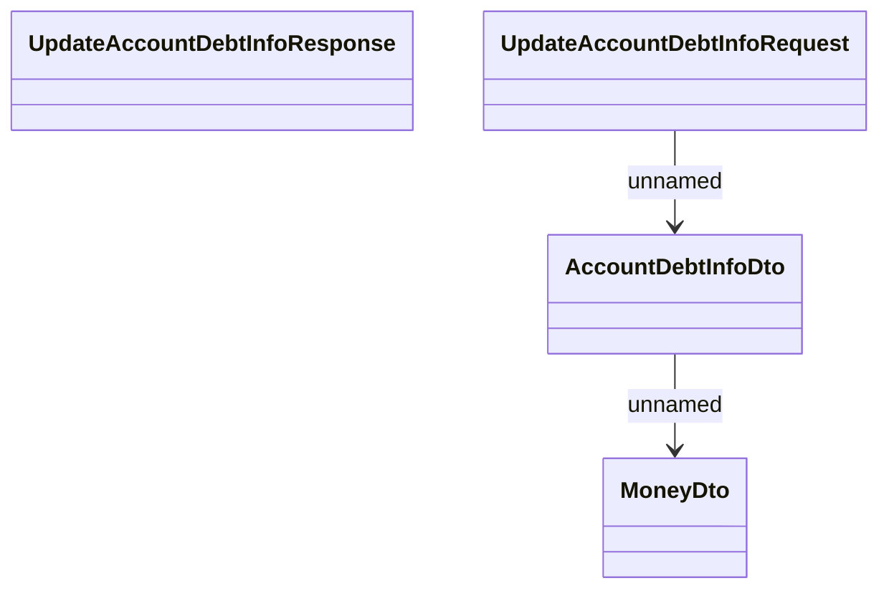

# Debt Catalog Types

```mermaid
classDiagram
    class UpdateAccountDebtInfoResponse["UpdateAccountDebtInfoResponse"]
    class UpdateAccountDebtInfoRequest["UpdateAccountDebtInfoRequest"]
    class AccountDebtInfoDto["AccountDebtInfoDto"]
    class MoneyDto["MoneyDto"]
    AccountDebtInfoDto --> MoneyDto : unnamed
    UpdateAccountDebtInfoRequest --> AccountDebtInfoDto : unnamed
```
