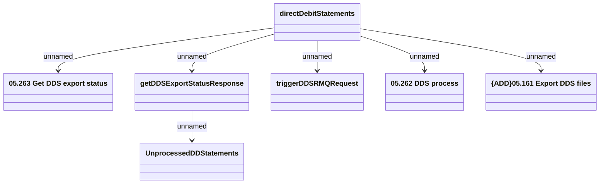

# Direct Debit Statements

```mermaid
classDiagram
    class n_05_263_Get_DDS_export_status["05.263 Get DDS export status"]
    class UnprocessedDDStatements["UnprocessedDDStatements"]
    class getDDSExportStatusResponse["getDDSExportStatusResponse"]
    class triggerDDSRMQRequest["triggerDDSRMQRequest"]
    class n_05_262_DDS_process["05.262 DDS process"]
    class ADD_05_161_Export_DDS_files["{ADD}05.161 Export DDS files"]
    class directDebitStatements["directDebitStatements"]
    directDebitStatements --> ADD_05_161_Export_DDS_files : unnamed
    directDebitStatements --> n_05_262_DDS_process : unnamed
    directDebitStatements --> triggerDDSRMQRequest : unnamed
    directDebitStatements --> getDDSExportStatusResponse : unnamed
    getDDSExportStatusResponse --> UnprocessedDDStatements : unnamed
    directDebitStatements --> n_05_263_Get_DDS_export_status : unnamed
```
