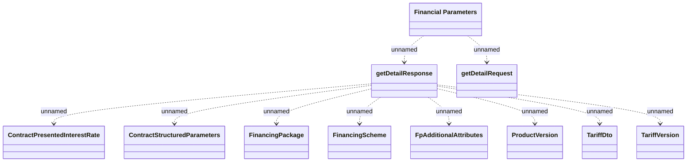

# Financial Parameters v1

- **Diagram Type**: Logical
- **Package**: HomerSelect/BSL/Analysis Model/_Interface/Provided Web Services/Financial Parameters/v1
- **Diagram ID**: 158612
- **Elements**: 11
- **Connectors**: 10

