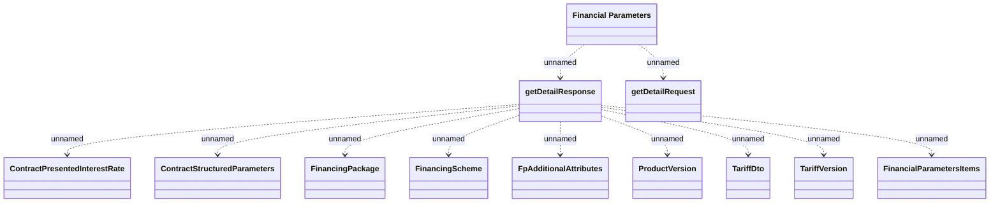

# Financial Parameters v2

- **Diagram Type**: Logical
- **Package**: HomerSelect/BSL/Analysis Model/_Interface/Provided Web Services/Financial Parameters/v2
- **Diagram ID**: 164370
- **Elements**: 12
- **Connectors**: 11

