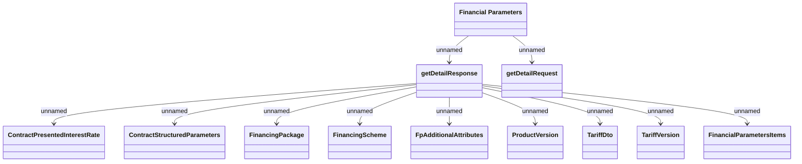

# Financial Parameters v2

```mermaid
classDiagram
    class FinancialParametersItems["FinancialParametersItems"]
    class TariffVersion["TariffVersion"]
    class TariffDto["TariffDto"]
    class ProductVersion["ProductVersion"]
    class FpAdditionalAttributes["FpAdditionalAttributes"]
    class FinancingScheme["FinancingScheme"]
    class FinancingPackage["FinancingPackage"]
    class ContractStructuredParameters["ContractStructuredParameters"]
    class ContractPresentedInterestRate["ContractPresentedInterestRate"]
    class getDetailResponse["getDetailResponse"]
    class getDetailRequest["getDetailRequest"]
    class Financial_Parameters["Financial Parameters"]
    Financial_Parameters --> getDetailRequest : unnamed
    Financial_Parameters --> getDetailResponse : unnamed
    getDetailResponse --> ContractPresentedInterestRate : unnamed
    getDetailResponse --> ContractStructuredParameters : unnamed
    getDetailResponse --> FinancingPackage : unnamed
    getDetailResponse --> FinancingScheme : unnamed
    getDetailResponse --> FpAdditionalAttributes : unnamed
    getDetailResponse --> ProductVersion : unnamed
    getDetailResponse --> TariffDto : unnamed
    getDetailResponse --> TariffVersion : unnamed
    getDetailResponse --> FinancialParametersItems : unnamed
```
