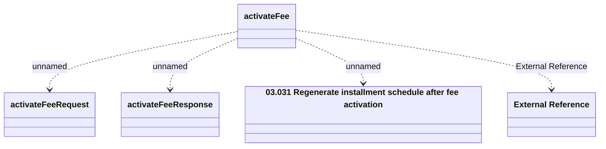

# activateFee_v1

- **Diagram Type**: Logical
- **Package**: HomerSelect/BSL/Analysis Model/_Interface/Provided Web Services/Installment Schedule/Activate fee/v1
- **Diagram ID**: 160987
- **Elements**: 5
- **Connectors**: 4

