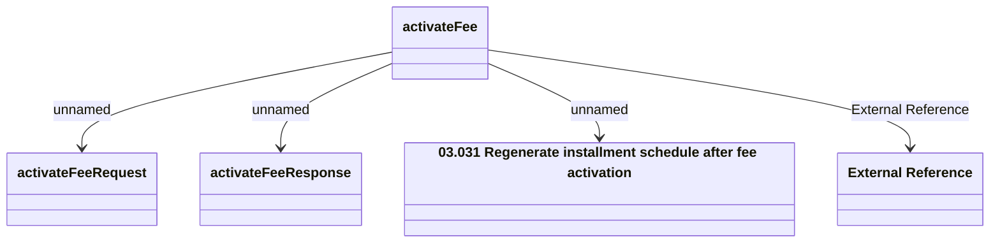

# activateFee_v1

```mermaid
classDiagram
    class n_03_031_Regenerate_installment_schedule_after_fee_activatio["03.031 Regenerate installment schedule after fee activation"]
    class activateFeeResponse["activateFeeResponse"]
    class activateFeeRequest["activateFeeRequest"]
    class activateFee["activateFee"]
    class External_Reference["External Reference"]
    activateFee --> activateFeeRequest : unnamed
    activateFee --> activateFeeResponse : unnamed
    activateFee --> n_03_031_Regenerate_installment_schedule_after_fee_activatio : unnamed
    activateFee --> External_Reference : External Reference
```
