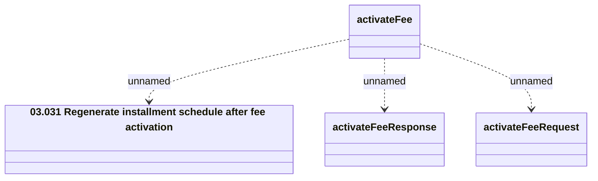

# activateFee_v2

- **Diagram Type**: Logical
- **Package**: HomerSelect/BSL/Analysis Model/_Interface/Provided Web Services/Installment Schedule/Activate fee/v2
- **Diagram ID**: 161016
- **Elements**: 4
- **Connectors**: 3

