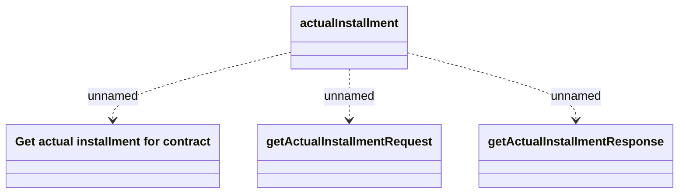

# actualInstallment

- **Diagram Type**: Logical
- **Package**: HomerSelect/BSL/Analysis Model/_Interface/Provided Web Services/Installment Schedule/Actual installment/v1
- **Diagram ID**: 159578
- **Elements**: 4
- **Connectors**: 3

