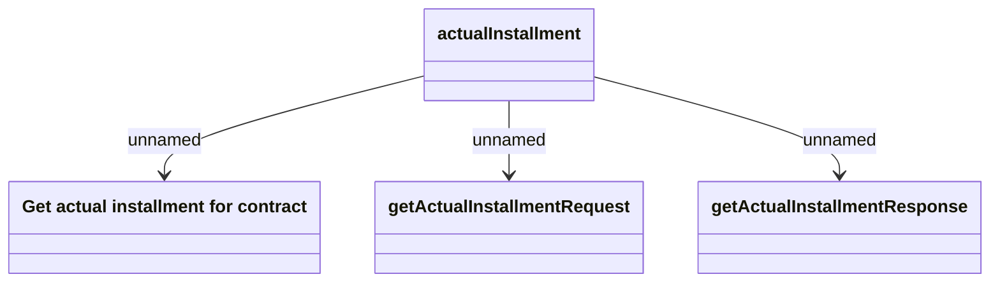

# actualInstallment

```mermaid
classDiagram
    class Get_actual_installment_for_contract["Get actual installment for contract"]
    class getActualInstallmentResponse["getActualInstallmentResponse"]
    class getActualInstallmentRequest["getActualInstallmentRequest"]
    class actualInstallment["actualInstallment"]
    actualInstallment --> Get_actual_installment_for_contract : unnamed
    actualInstallment --> getActualInstallmentRequest : unnamed
    actualInstallment --> getActualInstallmentResponse : unnamed
```
