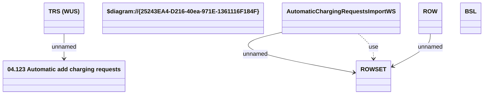

# AddChargingRequestsWS

- **Diagram Type**: Logical
- **Package**: HomerSelect/BSL/Analysis Model/_Interface/Provided Web Services/Installment Schedule/Add charging requests
- **Diagram ID**: 51577
- **Elements**: 7
- **Connectors**: 4

