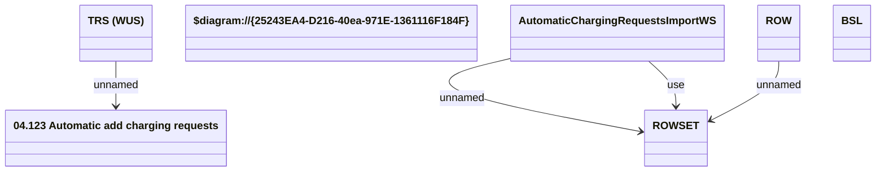

# AddChargingRequestsWS

```mermaid
classDiagram
    class TRS_WUS["TRS (WUS)"]
    class diagram_25243EA4_D216_40ea_971E_1361116F184F["$diagram://{25243EA4-D216-40ea-971E-1361116F184F}"]
    class ROW["ROW"]
    class ROWSET["ROWSET"]
    class AutomaticChargingRequestsImportWS["AutomaticChargingRequestsImportWS"]
    class BSL["BSL"]
    class n_04_123_Automatic_add_charging_requests["04.123 Automatic add charging requests"]
    AutomaticChargingRequestsImportWS --> ROWSET : unnamed
    AutomaticChargingRequestsImportWS --> ROWSET : use
    ROW --> ROWSET : unnamed
    TRS_WUS --> n_04_123_Automatic_add_charging_requests : unnamed
```
