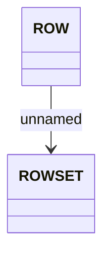

# ChargingRequests file structure

- **Diagram Type**: Logical
- **Package**: HomerSelect/BSL/Analysis Model/_Interface/Provided Web Services/Installment Schedule/Add charging requests/ChargingRequests
- **Diagram ID**: 70980
- **Elements**: 2
- **Connectors**: 1

