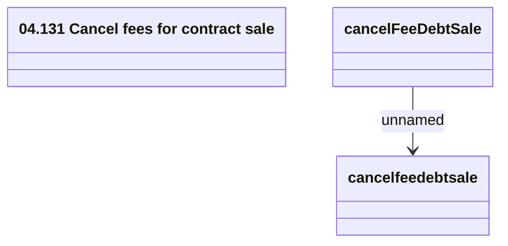

# cancelfeedebtsale

- **Diagram Type**: Logical
- **Package**: HomerSelect/BSL/Analysis Model/_Interface/Provided Web Services/Installment Schedule/Cancel fees for contract sale
- **Diagram ID**: 137688
- **Elements**: 3
- **Connectors**: 1

