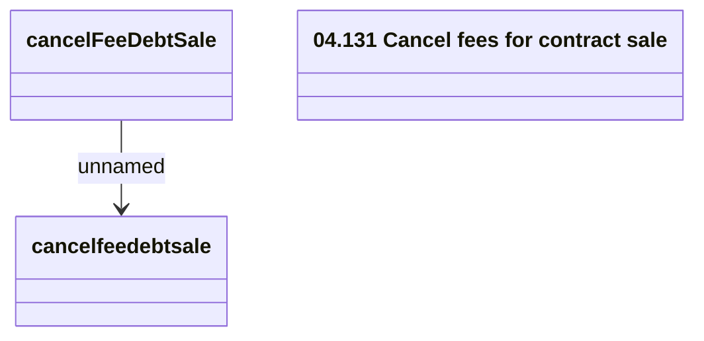

# cancelfeedebtsale

```mermaid
classDiagram
    class cancelFeeDebtSale["cancelFeeDebtSale"]
    class cancelfeedebtsale["cancelfeedebtsale"]
    class n_04_131_Cancel_fees_for_contract_sale[" 04.131 Cancel fees for contract sale"]
    cancelFeeDebtSale --> cancelfeedebtsale : unnamed
```
