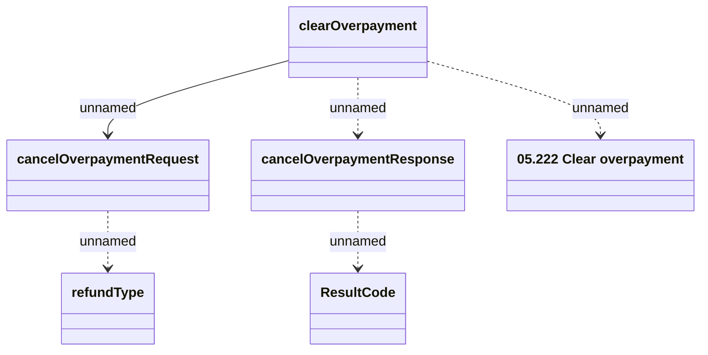

# Clear overpayment

- **Diagram Type**: Logical
- **Package**: HomerSelect/BSL/Analysis Model/_Interface/Provided Web Services/Installment Schedule/Clear overpayment
- **Diagram ID**: 149671
- **Elements**: 6
- **Connectors**: 5

