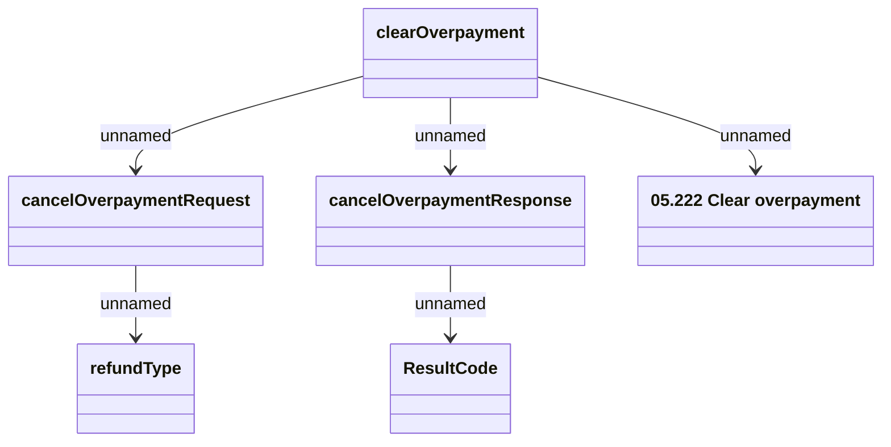

# Clear overpayment

```mermaid
classDiagram
    class ResultCode["ResultCode"]
    class cancelOverpaymentResponse["cancelOverpaymentResponse"]
    class refundType["refundType"]
    class cancelOverpaymentRequest["cancelOverpaymentRequest"]
    class clearOverpayment["clearOverpayment"]
    class n_05_222_Clear_overpayment["05.222 Clear overpayment"]
    clearOverpayment --> n_05_222_Clear_overpayment : unnamed
    clearOverpayment --> cancelOverpaymentRequest : unnamed
    cancelOverpaymentRequest --> refundType : unnamed
    clearOverpayment --> cancelOverpaymentResponse : unnamed
    cancelOverpaymentResponse --> ResultCode : unnamed
```
