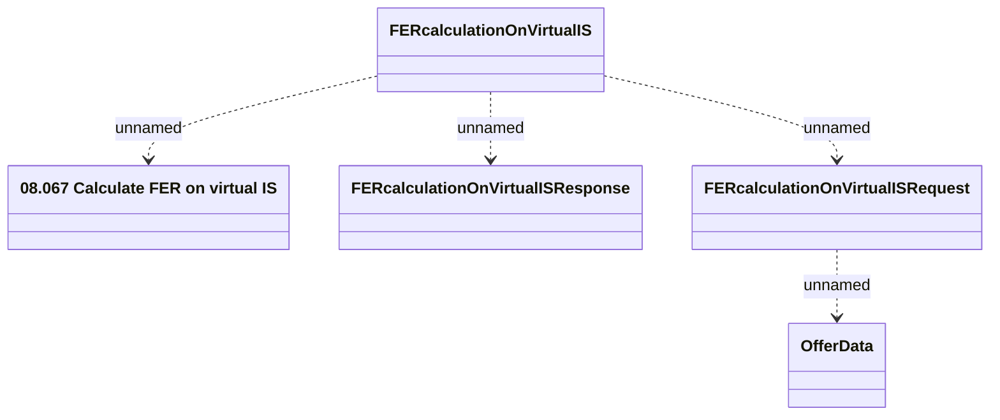

# FER calculation on virtual IS

- **Diagram Type**: Logical
- **Package**: HomerSelect/BSL/Analysis Model/_Interface/Provided Web Services/Installment Schedule/FER calculation on virtual IS
- **Diagram ID**: 164648
- **Elements**: 5
- **Connectors**: 4

