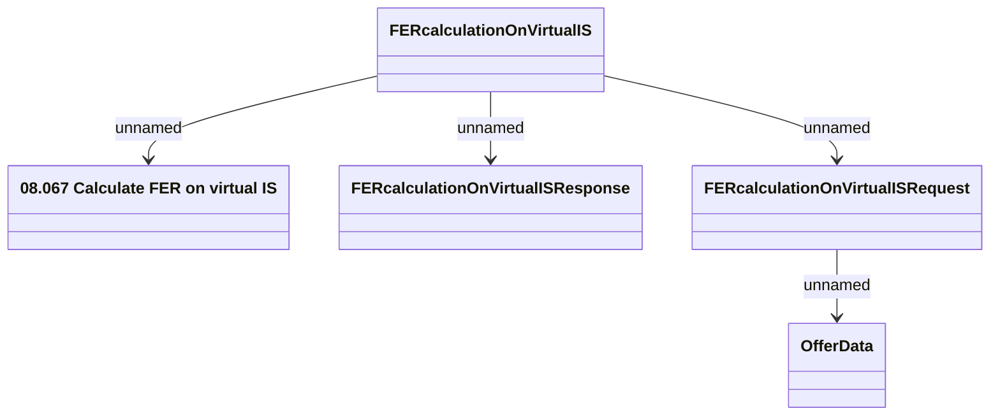

# FER calculation on virtual IS

```mermaid
classDiagram
    class n_08_067_Calculate_FER_on_virtual_IS["08.067 Calculate FER on virtual IS"]
    class OfferData["OfferData"]
    class FERcalculationOnVirtualISResponse["FERcalculationOnVirtualISResponse"]
    class FERcalculationOnVirtualISRequest["FERcalculationOnVirtualISRequest"]
    class FERcalculationOnVirtualIS["FERcalculationOnVirtualIS"]
    FERcalculationOnVirtualIS --> n_08_067_Calculate_FER_on_virtual_IS : unnamed
    FERcalculationOnVirtualISRequest --> OfferData : unnamed
    FERcalculationOnVirtualIS --> FERcalculationOnVirtualISResponse : unnamed
    FERcalculationOnVirtualIS --> FERcalculationOnVirtualISRequest : unnamed
```
