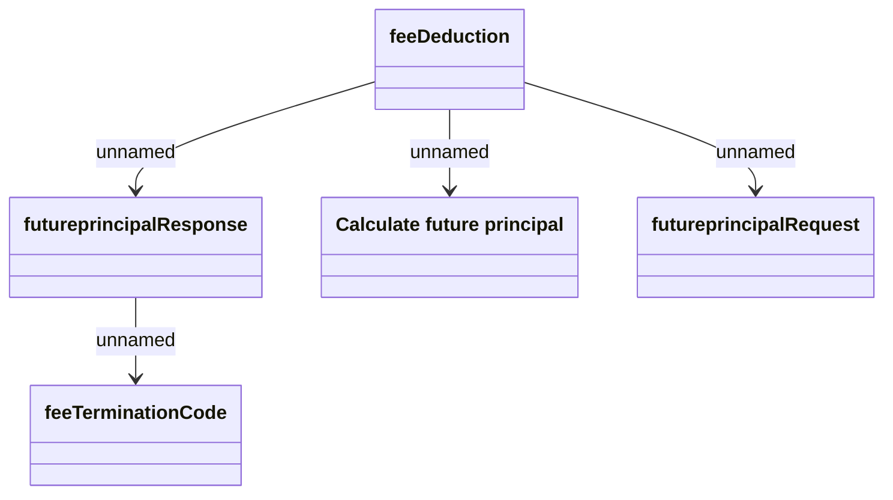

# feededuction

```mermaid
classDiagram
    class feeTerminationCode["feeTerminationCode"]
    class futureprincipalResponse["futureprincipalResponse"]
    class Calculate_future_principal["Calculate future principal"]
    class futureprincipalRequest["futureprincipalRequest"]
    class feeDeduction["feeDeduction"]
    futureprincipalResponse --> feeTerminationCode : unnamed
    feeDeduction --> futureprincipalResponse : unnamed
    feeDeduction --> futureprincipalRequest : unnamed
    feeDeduction --> Calculate_future_principal : unnamed
```
