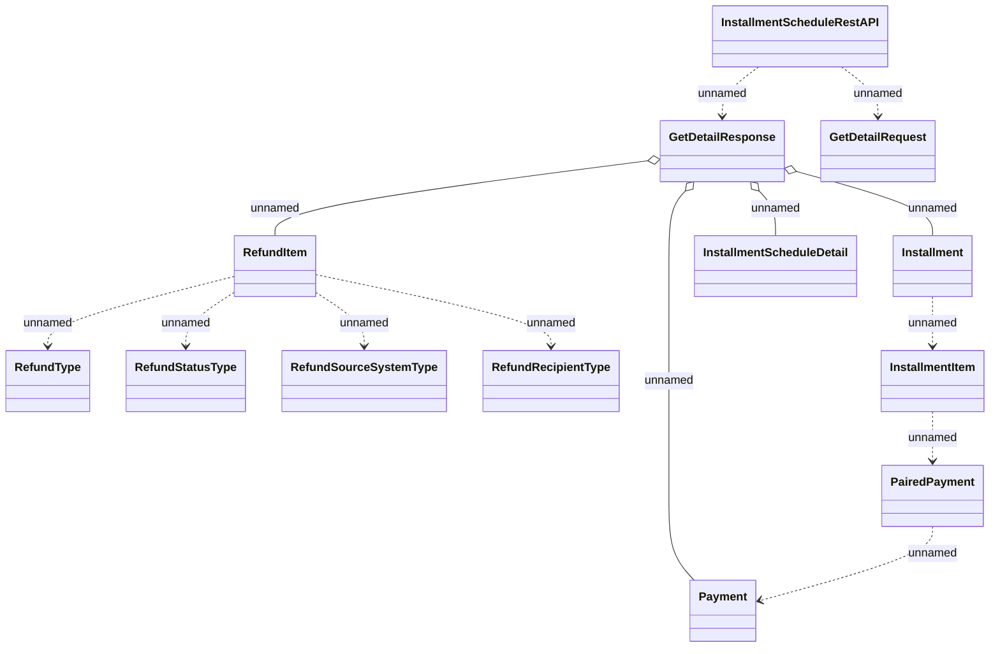

# InstallmentScheduleRestAPI v2 - Get Detail

- **Diagram Type**: Logical
- **Package**: HomerSelect/BSL/Analysis Model/_Interface/Provided Web Services/Installment Schedule/Installment schedule/InstallmentScheduleRestAPI v2_new
- **Diagram ID**: 164348
- **Elements**: 13
- **Connectors**: 13

