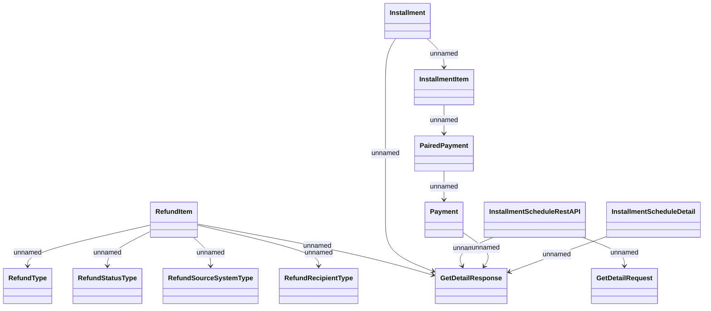

# InstallmentScheduleRestAPI v2 - Get Detail

```mermaid
classDiagram
    class RefundType["RefundType"]
    class RefundStatusType["RefundStatusType"]
    class RefundSourceSystemType["RefundSourceSystemType"]
    class RefundRecipientType["RefundRecipientType"]
    class PairedPayment["PairedPayment"]
    class InstallmentItem["InstallmentItem"]
    class Installment["Installment"]
    class Payment["Payment"]
    class RefundItem["RefundItem"]
    class InstallmentScheduleDetail["InstallmentScheduleDetail"]
    class GetDetailResponse["GetDetailResponse"]
    class GetDetailRequest["GetDetailRequest"]
    class InstallmentScheduleRestAPI["InstallmentScheduleRestAPI"]
    InstallmentScheduleRestAPI --> GetDetailRequest : unnamed
    RefundItem --> GetDetailResponse : unnamed
    Installment --> GetDetailResponse : unnamed
    InstallmentScheduleRestAPI --> GetDetailResponse : unnamed
    Payment --> GetDetailResponse : unnamed
    InstallmentScheduleDetail --> GetDetailResponse : unnamed
    PairedPayment --> Payment : unnamed
    Installment --> InstallmentItem : unnamed
    InstallmentItem --> PairedPayment : unnamed
    RefundItem --> RefundRecipientType : unnamed
    RefundItem --> RefundSourceSystemType : unnamed
    RefundItem --> RefundStatusType : unnamed
    RefundItem --> RefundType : unnamed
```
