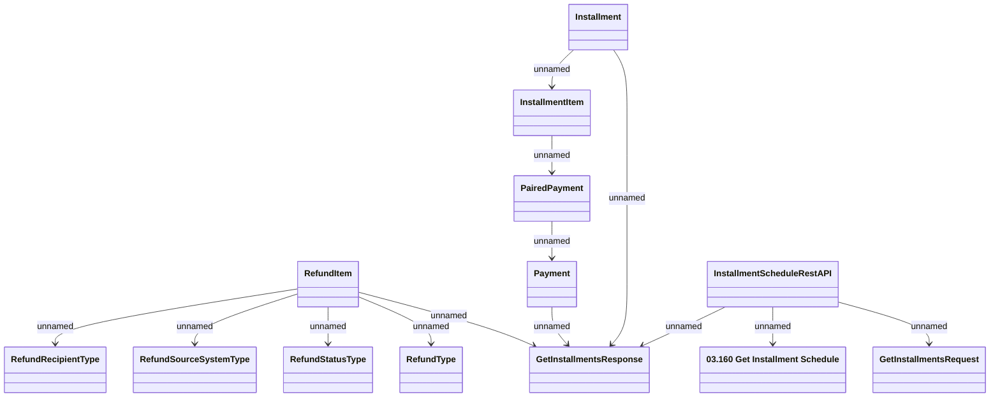

# InstallmentScheduleRestAPI v2 - Get Installments

```mermaid
classDiagram
    class PairedPayment["PairedPayment"]
    class InstallmentItem["InstallmentItem"]
    class RefundType["RefundType"]
    class RefundStatusType["RefundStatusType"]
    class RefundSourceSystemType["RefundSourceSystemType"]
    class RefundRecipientType["RefundRecipientType"]
    class RefundItem["RefundItem"]
    class Payment["Payment"]
    class Installment["Installment"]
    class GetInstallmentsResponse["GetInstallmentsResponse"]
    class GetInstallmentsRequest["GetInstallmentsRequest"]
    class n_03_160_Get_Installment_Schedule["03.160 Get Installment Schedule"]
    class InstallmentScheduleRestAPI["InstallmentScheduleRestAPI"]
    InstallmentScheduleRestAPI --> n_03_160_Get_Installment_Schedule : unnamed
    InstallmentScheduleRestAPI --> GetInstallmentsRequest : unnamed
    InstallmentScheduleRestAPI --> GetInstallmentsResponse : unnamed
    Installment --> GetInstallmentsResponse : unnamed
    Payment --> GetInstallmentsResponse : unnamed
    RefundItem --> GetInstallmentsResponse : unnamed
    PairedPayment --> Payment : unnamed
    RefundItem --> RefundRecipientType : unnamed
    RefundItem --> RefundSourceSystemType : unnamed
    RefundItem --> RefundStatusType : unnamed
    RefundItem --> RefundType : unnamed
    Installment --> InstallmentItem : unnamed
    InstallmentItem --> PairedPayment : unnamed
```
