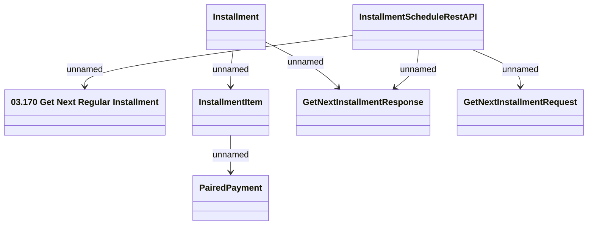

# InstallmentScheduleRestAPI v2 - Get Next Installment

```mermaid
classDiagram
    class PairedPayment["PairedPayment"]
    class n_03_170_Get_Next_Regular_Installment["03.170 Get Next Regular Installment"]
    class InstallmentItem["InstallmentItem"]
    class Installment["Installment"]
    class GetNextInstallmentResponse["GetNextInstallmentResponse"]
    class GetNextInstallmentRequest["GetNextInstallmentRequest"]
    class InstallmentScheduleRestAPI["InstallmentScheduleRestAPI"]
    InstallmentScheduleRestAPI --> GetNextInstallmentRequest : unnamed
    Installment --> GetNextInstallmentResponse : unnamed
    InstallmentScheduleRestAPI --> GetNextInstallmentResponse : unnamed
    Installment --> InstallmentItem : unnamed
    InstallmentScheduleRestAPI --> n_03_170_Get_Next_Regular_Installment : unnamed
    InstallmentItem --> PairedPayment : unnamed
```
