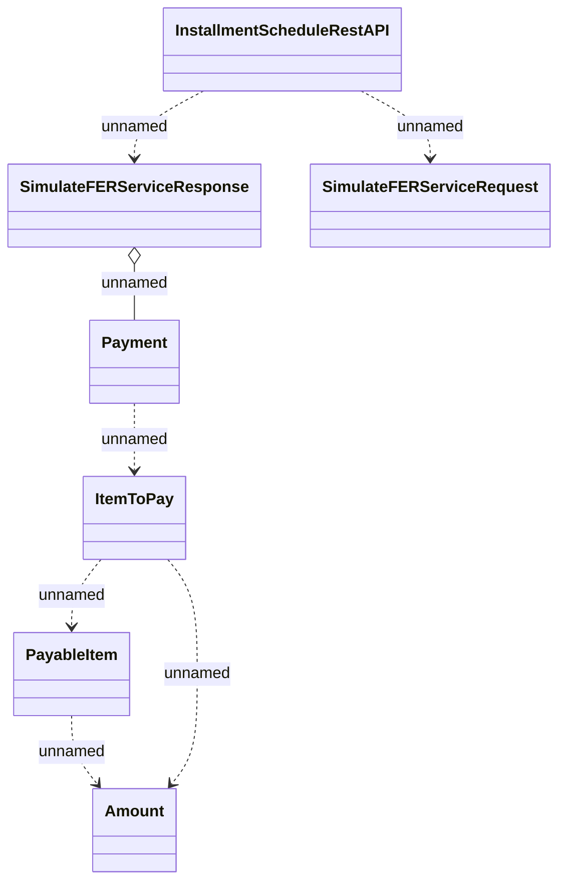

# InstallmentScheduleRestAPI v2 - Simulate FER Service

- **Diagram Type**: Logical
- **Package**: HomerSelect/BSL/Analysis Model/_Interface/Provided Web Services/Installment Schedule/Installment schedule/InstallmentScheduleRestAPI v2_new
- **Diagram ID**: 164351
- **Elements**: 7
- **Connectors**: 7

