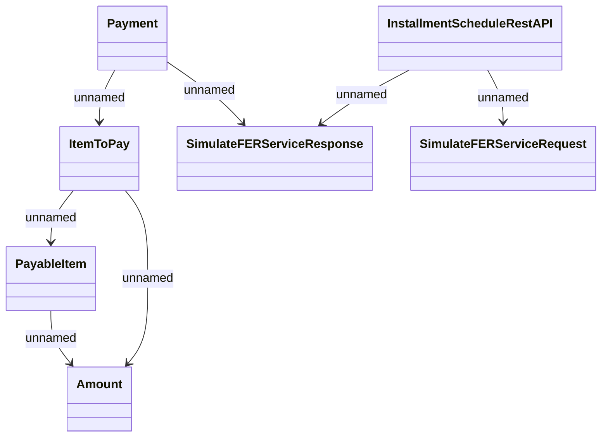

# InstallmentScheduleRestAPI v2 - Simulate FER Service

```mermaid
classDiagram
    class Amount["Amount"]
    class PayableItem["PayableItem"]
    class ItemToPay["ItemToPay"]
    class Payment["Payment"]
    class SimulateFERServiceResponse["SimulateFERServiceResponse"]
    class SimulateFERServiceRequest["SimulateFERServiceRequest"]
    class InstallmentScheduleRestAPI["InstallmentScheduleRestAPI"]
    InstallmentScheduleRestAPI --> SimulateFERServiceRequest : unnamed
    Payment --> SimulateFERServiceResponse : unnamed
    InstallmentScheduleRestAPI --> SimulateFERServiceResponse : unnamed
    Payment --> ItemToPay : unnamed
    ItemToPay --> PayableItem : unnamed
    PayableItem --> Amount : unnamed
    ItemToPay --> Amount : unnamed
```
