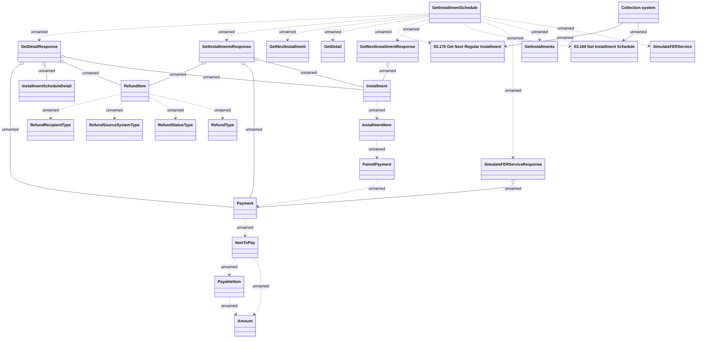

# installmentSchedule

- **Diagram Type**: Logical
- **Package**: HomerSelect/BSL/Analysis Model/_Interface/Provided Web Services/Installment Schedule/Installment schedule/InstallmentScheduleRestAPIv1_new
- **Diagram ID**: 154920
- **Elements**: 26
- **Connectors**: 32

